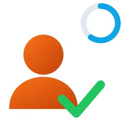

# VeriRandom

**A random-selection tool for classrooms and teams, with configurable workflows, managed history, and verifiable draw records.**

**Language** [ [简体中文](../README.md) | **English** | [日本語](README_JA.md) ]

> [!IMPORTANT]
> This product is an open-source fork of SecRandom and must not be regarded as SecRandom itself

> [!NOTE]
> VeriRandom is released under GNU GPLv3. You may modify and redistribute the source, but derivative redistributions must also use GNU GPLv3.

## VeriRandom

VeriRandom is a fair random-selection application for classrooms, teams, events, decision-making, and other scenarios.

## Features

### Draw workflows

- **Roll call**: Supports standard random, history-balanced, and repeat-control draws.
- **Quick draw**: Quickly draws students through a standalone floating window.
- **Lottery**: Supports prize-wheel and inventory draws, with students and prizes managed independently.
- **Rich presentation**: Provides unified settings for animation, results, speech, music, and notifications, with fallback when a notification fails.

### Fairness and list management

- Dynamically adjusts weights using history count, draw interval, group, gender, and other factors to reduce repeats and distribution imbalance.
- Uses stable internal identifiers to preserve history; student numbers, IDs, and names are display information only.
- Supports multiple student lists, prize pools, and `.xlsx`, `.xls`, `.csv` import, mapping, and preview.
- Saves history for every draw round for convenient review.

### Reviewable draw results

- Every draw automatically saves a proof record file.
- You can choose to involve the server in and witness the draw process.
- Draw results can be checked again through official channels.

### Data, privacy, and security

- Settings, lists, and history can all be imported, exported, backed up, and restored.
- Backups may include lists, history, draw proofs, images, and audio, but never passwords or other security information.
- Password, TOTP, or USB-drive protection can secure important operations, and you can choose which operations require verification.

### Verification boundaries

| Mode | What it can do | What it cannot prove |
|---|---|---|
| Offline proof | Review a completed draw process; later edits, deletions, and a wiped-and-rebuilt chain are all detectable | It cannot prove that the local program, random seed, or roster was unchanged **before** the draw, nor rule out repeated trials and selection before it |
| Online witnessing | Protect the draw flow after the server locks it | It cannot prove that the roster is authentic, complete, or unfiltered before submission |

Notes:

- Every draw saves a locally replayable proof immediately and submits that same proof for server replay signing; its digest also goes to a third-party time-stamp authority (the digest only — never the roster or the draw content)
- Local proofs form an append-only hash chain, so deleting or rewriting one leaves a gap; the service remembers the chain head it has seen for each device, so wiping local proofs and rebuilding the chain is reported as a backwards chain position
- A proof commits a digest of the "record id to name/number/group" mapping of the roster it used, so editing the list **after** the draw to point a winning record at someone else is detectable
- Filtering the roster **before** the draw (deleting or disabling a student first) cannot be proven: the digest only covers the roster as it stood at draw time. Covering that would need a "confirm the roster with a third party before drawing" flow, which is not implemented

## Technical evolution

| Version | Stack | Stage |
| --- | --- | --- |
| v1 | Python + PyQt5 + qfluentwidgets | First desktop implementation |
| v2 | Python + PySide6 + qfluentwidgets | Qt stack evolution |
| **v3** | **C# + Avalonia + FluentAvalonia** | .NET desktop rewrite for continued draw, verification, and desktop-integration development |

## Download and updates

- [GitHub Releases](https://github.com/WinFunan/VeriRandom/releases) provides release packages and change notes for this fork.

## Upstream download and updates

- [GitHub Releases](https://github.com/SECTL/SecRandom/releases) provides upstream release packages and change notes.
- The [upstream official download page](https://stk.sectl.cn/SecRandom) provides the latest upstream download entry point.
- Automatic updates validate a signed release manifest and artifact length/hash before deployment. Refer to the package and notes supplied with each release for installation details.

## License and third-party notices

- VeriRandom is released under [GNU GPLv3](../LICENSE).
- See [THIRD-PARTY-NOTICES.md](../THIRD-PARTY-NOTICES.md) for third-party components, copyright information, and distribution-review notes.
- History-balanced weights and candidate filters help reduce repeat selections and improve long-term distribution. They do not replace management of real-world rosters, rules, or processes, and VeriRandom does not claim to verify those conditions.

## Contributors and special thanks

Thank you to everyone who contributes code, reports issues, improves documentation, or provides feedback to VeriRandom and SecRandom. The avatars are generated from GitHub contributor data; select them to open the [this repository's GitHub contributors page](https://github.com/WinFunan/VeriRandom/graphs/contributors) or the [upstream GitHub contributors page](https://github.com/SECTL/SecRandom/graphs/contributors) for complete statistics.

## Support and community for this repository

- [QQ Group 768421833](https://qm.qq.com/q/EvhyCJWqCA)
- [Email](mailto:love-code-yeyixiao@outlook.com)
- [Bilibili](https://space.bilibili.com/510993086)
- [Report an issue](https://github.com/WinFunan/VeriRandom/issues)
- [English contributing guide](CONTRIBUTING_EN.md)

## Support and community for upstream

- [Support upstream on Afdian](https://afdian.com/a/lzy0983)
- [Email](mailto:lzy.12@foxmail.com)
- [QQ Group 833875216](https://qm.qq.com/q/iWcfaPHn7W)
- [QQ Channel](https://pd.qq.com/s/4x5dafd34?b=9)
- [Bilibili](https://space.bilibili.com/520571577)
- [Report an issue](https://github.com/SECTL/SecRandom/issues)
- [SecRandom documentation](https://secrandom.sectl.cn/doc/overview.html)
- 
- [Simplified Chinese contributing guide](https://github.com/SECTL/SecRandom/CONTRIBUTING.md)

**Copyright © 2025-2026 WinFunan**

**Copyright © 2025-2026 SECTL**
